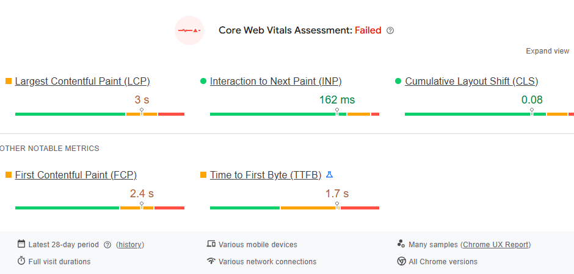
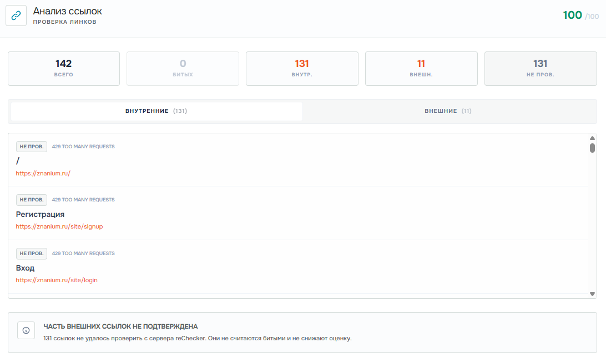

# Лабораторная работа №2. Техническая оптимизация, дополнительные настройки

<strong>Сайт для анализа</strong> - znanium.ru

## 1. Технические характеристики сайта

1. Файл Robots.txt присутствует (см. рисунок 1);

Рисунок 1. Подтверждение присутствие файла robots.txt

2. Вместо 404 возвращает 429 ошибку (согласно анализу rechecker.ru). Несуществующие страницы должны возвращать 404 или 410 (см. рисунок 2);

Рисунок 2. Вместо 404 ошибки сайт возвращает 429 ошибку

3. Анализ скорости загрузки проводился с помощью ресурса PageSpeed insights;

### Core Web Vitals Assessment провалился (см. рисунок 3):

- Largest Contentful Paint (LCP): 3 секунды (желтая зона);

- Interaction to the Next Paint (INP): 162 мс (зеленая зона);

- Cumulative Layout Shift (CLS): 0.08с (зеленая зона);

- First Contentful Paint (FCP): 2,4с (желтая зона);

- Time to First Byte (TTFB): 1,7с (желтая, очень близко к красной зоне).

Рисунок 3. Core Web Vitals Assessment

4. Оптимизация под мобильные устройства. С помощью ресурса reChecker выяснилось, что отсутствует мета-тег viewport, что критично - без него мобильные устройства рендерят страницу как десктопную - сайт не адаптируется под экран (см. рисунок 4);

Рисунок 4. Отсутствие метатега viewport

5. HTML-валидация не выполнялась ресурсом reChecker - документ больше указанного размера (см. рисунок 5). Другие ресурсы также отказались выполнять HTML-валидацию;

Рисунок 5. Невыполнение HTML-валидации

6. Наличие битых ссылок проверялось с помощью ресурса reChecker. Данный ресурс не нашел битых ссылок на сайте (см. рисунок 6);

Рисунок 6. Проверка на битые ссылки

7. Дубликатов контента ни один ресурс не показал, но есть редирект с znanium.com на znanium.ru

## 2. Предложения по оптимизации сайта

1. Вместо 429 ошибки, как сейчас, необходимо возвращать 404 ошибку. 429 ошибка означает, что слишком много запросов приходит на сервер (Too many requests), тогда как 404 ошибка говорит, что ничего не найдено (Not found);

2. Уменьшить размер файлов контента для того, чтобы уменьшить время загрузки LCP, FCP и особенно TTFB;

3. Добавить метатег viewport, чтобы сайт адаптировался под экран устройства.
