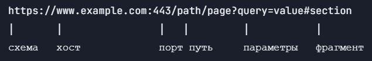

# Жизненный цикл HTTP-запроса

## Содержание

#### 1. Введение 
#### 2. Цикл HTTP-запроса
#### 2.2. Шаг 1. Парсинг URL
#### 2.3. Шаг 2. DNS-разрешение
#### 2.4. Шаг 3. TCP-соединение
#### 2.5. Шаг 4. Отправка HTTP-запроса
#### 2.6. Шаг 5. Обработка запроса на сервере
#### 2.7. Шаг 6. HTTP-ответ
#### 2.8. Шаг 7. Рендеринг в браузере
#### 3. Список использованных источников

## Введение

Когда в браузер вводится URL и пользователь нажимает Enter, за миллисекунды разворачивается сложная цепочка событий. Понимание этого цикла фундаментально для веб-разработчиков — это основа диагностики проблем производительности, безопасности и сетевых ошибок.

## Цикл HTTP-запроса

### Шаг 1. Парсинг URL

Клиент разбирает URL на компоненты. На рисунке 1 представлен разбор URL


Рисунок 1. Разбор URL на компоненты

Клиент проверяет,URL ли это или поисковый запрос. Без схемы — добавит https://. Без порта — по умолчанию (443 для HTTPS, 80 для HTTP). 

### Шаг 2. DNS-разрешение

Далее, клиент проверяет свое внутреннее хранилище (кэш) для получения соответствующего IP-адреса. Если IP-адрес не найден в кэше, клиент отправляет запрос на разрешение доменного имени (DNS resolution). Запрос на разрешение доменного имени отправляется к DNS-серверу, чтобы получить соответствующий IP-адрес, связанный с доменным именем. В случае, если DNS-сервер имеет запись для запрашиваемого доменного имени, он отправляет IP-адрес обратно в браузер

### Шаг 3. TCP-соединение

Далее, использует полученный IP-адрес для установления TCP-соединения с сервером. Браузер устанавливает TCP-соединение через тройное рукопожатие:

1. SYN: клиент отправляет пакет синхронизации;

2. SYN-ACK: сервер подтверждает и отправляет свой SYN;

3. ACK: клиент подтверждает — соединение установлено.

После завершения рукопожатия устанавливается стабильное TCP-соединение между браузером и сервером, которое будет использоваться для передачи данных.

### Шаг 4. Отправка HTTP-запроса

Браузер формирует HTTP-запрос, который содержит метод (GET, POST, PUT и другие), путь к запрашиваемому ресурсу (URI), версию протокола HTTP и другие заголовки. Запрос может также содержать тело, в случае POST-запроса, когда данные отправляются на сервер. Браузер отправляет сформированный HTTP-запрос по установленному TCP-соединению на сервер.

### Шаг 5. Обработка запроса на сервере

1. Веб-сервер: Nginx/Apache принимает запрос;

2. Реверс-прокси: может передать на application server;

3. Приложение: маршрутизация, бизнес-логика, запросы к БД;

4. База данных: выполнение запросов;

5. Генерация ответа: приложение строит HTML/JSON;

6. Сжатие: gzip/Brotli.

### Шаг 6. HTTP-ответ

```
HTTP/2 200 OK
Content-Type: text/html; charset=utf-8
Content-Encoding: br
Cache-Control: max-age=3600
Content-Length: 45231
```

Пример HTTP-ответа

### Шаг 7. Рендеринг в браузере

1. Парсинг HTML: построение DOM-дерева;

2. Парсинг CSS: построение CSSOM-дерева;

3. Выполнение JS: может блокировать рендеринг;

4. Render tree: объединение DOM + CSSOM;

5. Layout: вычисление позиций и размеров;

6. Paint: отрисовка пикселей;

7. Composite: компоновка слоёв в финальное изображение.

## Список использованных источников

1. https://enterno.io/articles/http-request-lifecycle

2. https://dzen.ru/a/ZKglsLsqoB7IJRDU