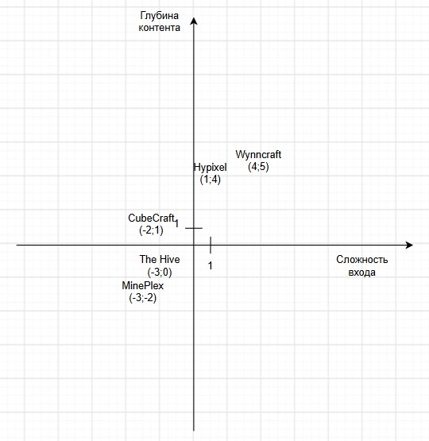

# Анализ конкурентов. Тема: сервер minecraft

## Пункты 1-2. Сервера и их характеристики

### Hypixel

#### Характеристика: 

Крупнейший в мире Minecraft-сервер, занесённый в Книгу рекордов Гиннесса. Предлагает десятки оригинальных мини-игр: SkyBlock, Bed Wars, SkyWars и многие другие. Поддерживает версии с 1.8 по 1.21. Монетизация осуществляется через продажу VIP-рангов и косметических предметов, не влияющих на геймплей. Онлайн достигает 95 000 игроков.

#### Плюсы:

1. Огромное количество игроков - всегда есть с кем играть;
2. Десятки оригинальных мини-игр;
3. Регулярные обновления мини-игр;
4. Высокое качество исполнения, античит Watchdog.

#### Минусы:

1. Высокая конкуренция (среди игроков) - новичку сложно выделиться;
2. Высокий пинг для игроков из России и СНГ;
3. Многие режимы требуют платного VIP для полноценного доступа;
4. Англоязычное сообщество - языковой барьер.

### Mineplex

#### Характеристика:

Один из старейших и крупнейших серверов, основанный в 2013 году. Специализируется на мини-играх - более 40 режимов, включая Turf Wars, Micro Battle, Dragon Escape. Поддерживает как Java, так и Bedrock версии. В 2023 году сервер был закрыт, но впоследствии возобновил работу.

#### Плюсы:

1. Огромное разнообразие мини-игры;
2. Уникальные игровые механики (классы, способности, звуковое сопровождение);
3. Поддержка обеих версий (Java и Bedrock);
4. Дружелюбное сообщество.

#### Минусы:

1. Сервер пережил закрытие - стабильность под вопросом;
2. Онлайн значительно снизился;
3. Высокий пинг для СНГ-игроков;
4. Меньше обновлений, чем у лидеров.

### CubeCraft Games

#### Характеристика:

Один из крупнейших серверных сетей мира. Именно CubeCraft стал пионером популярных режимов, включая SkyWars. На Java-версии представлено около 50 игровых режимов, на Bedrock - 10 мини-игр: EggWars, SkyWars, Survival Games, Bridges, Capture The Flag, Lucky Blocks, Skyblock, MinerWare, Battle Arena, Parkour. Поддерживает версию 1.20+.

#### Плюсы:

1. Более 50 режимов на Java;
2. Оригинальные режимы, ставшие классикой;
3. Кроссплатформенность (Java и Bedrock);
4. Стабильная работа 24/7, поддержка тысяч игроков

#### Минусы:

1. Меньший онлайн, чем у Hypixel;
2. Англоязычный интерфейс;
3. Для Bedrock ограниченный выбор режимов;
4. Монетизация может ощущаться как pay-to-win.

### The Hive

#### Характеристика:

Популярный сервер с мини-играми, ориентированный в первую очередь на Bedrock Edition. Предлагает такие режимы как Treasure Wars (аналог Bed Wars), Hide and Seek, а также PvP, PvE, паркур и моб-арену. Имеет серверные локации в Северной Америке и Европе.

#### Плюсы:

1. Лучший Bedrock-сервер по версии многих рейтингов;
2. Уникальные режимы, не встречающиеся на других серверах;
3. Низкий пинг для европейских игроков;
4. Активное сообщество.

#### Минусы:

1. Ограниченная поддержка Java (в основном версии 1.8-1.11);
2. Меньше режимов, чем у Hypixel/CubeCraft;
3. Требуется установка ресурспака для некоторых режимов;
4. Монетизация через игровые покупки.

### Wynncraft

#### Характеристика:

Уникальный MMORPG-сервер в мире Minecraft. Предлагает полноценную RPG с классами персонажей (5 классов, 15 архетипов), системой прокачки, сотнями квестов, подземельями, рейдами, гильдиями и внутриигровой экономикой. Для игры не требуется установка модов — всё реализовано на плагинах. Карта сервера огромна и детализирована.

#### Плюсы:

1. Уникальный жанр - полноценная ММО внутри Minecraft;
2. Огромный мир с собственной историей и лором;
3. Бесплатная игра , без модов:
4. Тысячи часов контента:
5. Кросплатформенность, поддержка многих версий

#### Минусы:

1. Требуется время для входа в игру (RPG-процессия);
2. Онлайн скромнее (~350 игроков в день);
3. Сложная для новичков система;
4. Отсутствует PvP в классическом понимании - упор на PvE;
5. Почти полностью на английском языке

## 3. Оценка удобства использования

Таблица 1. Оценка удобства использования

<table>
    <tr>
        <th>Сервер</th>
        <th>Что понравилось</th>
        <th>В чем неудобство</th>
    </tr>
    <tr>
        <td>Hypixel</td>
        <td>Огромный набор режимов, понятное меню, быстрый вход</td>
        <td>Высокий пинг из РФ; сложно разобраться новичку из-за обилия контента.</td>
    </tr>
    <tr>
        <td>Mineplex</td>
        <td>Простой интерфейс, дружелюбное сообщество</td>
        <td>Низкий онлайн; старый интерфейс; нестабильная работа после возобновления</td>
    </tr>
    <tr>
        <td>CubeCraft</td>
        <td>Удобная навигация по режимам, поддержка двух версий</td>
        <td>Для Bedrock мало режимов, англоязычный интерфейс</td>
    </tr>
    <tr>
        <td>The Hive</td>
        <td>Отличная оптимизация для Bedrock, уникальные режимы</td>
        <td>Ограниченная поддержка Java, требует ресурспак</td>
    </tr>
    <tr>
        <td>Wynncraft</td>
        <td>Уникальный RPG-опыт; огромный мир для исследования</td>
        <td>Сложный вход для новичков, требует много времени и ресурсов</td>
    </tr>
</table>

## 4. Целевая аудитория

Таблица 2. ЦА

<table>
    <tr>
        <th>Сервер</th>
        <th>Целевая аудитория</th>
    </tr>
    <tr>
        <td>Hypixel</td>
        <td>Игроки, ищущие разнообразные мини-игры и соревновательный опыт; фанаты Bed Wars и SkyBlock; пользователи со всего мира</td>
    </tr>
    <tr>
        <td>Mineplex</td>
        <td>Игроки, ценящие классические мини-игры; ностальгирующие ветераны; пользователи Java и Bedrock</td>
    </tr>
    <tr>
        <td>CubeCraft</td>
        <td>Игроки, предпочитающие сбалансированные мини-игры; любители SkyWars и EggWars; кроссплатформенные игроки</td>
    </tr>
    <tr>
        <td>The Hive</td>
        <td>Преимущественно Bedrock-игроки (консоль, мобильные устройства); любители казуальных мини-игр</td>
    </tr>
    <tr>
        <td>Wynncraft</td>
        <td>Фанаты RPG и MMORPG; игроки, ищущие глубокий сюжет и прогрессию; любители PvE и исследований</td>
    </tr>
</table>

## 5. Цели и задачи серверов

Таблица 3. Цели и задачи серверов

<table>
    <tr>
        <th>Сервер</th>
        <th>Цель</th>
        <th>Задачи</th>
    </tr>
    <tr>
        <td>Hypixel</td>
        <td>Удерживать статус крупнейшего сервера в мире</td>
        <td>Постоянно добавлять новые режимы; удерживать высокий онлайн; монетизировать через косметику</td>
    </tr>
    <tr>
        <td>Mineplex</td>
        <td>Восстановить позиции после перезапуска</td>
        <td>Вернуть доверие игроков; увеличить онлайн; обновлять контент</td>
    </tr>
    <tr>
        <td>CubeCraft</td>
        <td>Быть ведущим кроссплатформенным сервером</td>
        <td>Развивать оба издания (Java и Bedrock); создавать новые режимы; удерживать аудиторию</td>
    </tr>
    <tr>
        <td>The Hive</td>
        <td>Доминировать на Bedrock-рынке</td>
        <td>Оптимизировать для консолей и мобильных устройств; создавать уникальные режимы</td>
    </tr>
    <tr>
        <td>Wynncraft</td>
        <td>Предлагать лучший RPG-опыт в Minecraft</td>
        <td>Расширять мир; добавлять квесты и контент; удерживать лояльное сообщество</td>
    </tr>
</table>

## 6. Матрица позиционирования

Ось Х: сложность входа / порог вхождения (от низкого к высокому)

Ось Y: глубина контента / вовлеченность (от низкой к высокой)

Рисунок 1. Матрица позиционирования

## 7. SWOT-анализ

### Сильные стороны:

1. Уникальная концепция / режим, не представленный у конкурентов

2. Низкий пинг для игроков из России и СНГ (локальный хостинг)

3. Гибкая монетизация без pay-to-win

4. Быстрая адаптация к пожеланиям сообщества

5. Русскоязычное комьюнити и поддержка

### Слабые стороны:

1. Отсутствие узнаваемости бренда

2. Ограниченный бюджет на рекламу и разработку

3. Маленький онлайн на старте

4. Отсутствие опыта в управлении крупным сервером

5. Технические риски (DDoS, лаги, сбои)

### Возможности:

1. Рост аудитории Minecraft (более 200 млн активных игроков в месяц)

2. Ниша русскоязычных серверов с качественным контентом

3.  Растущий спрос на уникальные режимы (Lifesteal, Anarchy, RPG)

4. Использование мониторингов для бесплатного продвижения

5. Развитие донатной системы с уникальными косметическими предметами

6. Сотрудничество с блогерами и стримерами для рекламы

### Угрозы:

1. Доминирование Hypixel с онлайном 95 000 игроков

2. Высокая конкуренция — тысячи серверов в мониторингах

3. Крупные сети с огромными рекламными бюджетами

4. Изменения в политике Mojang / Microsoft

5. Технические угрозы (DDoS-атаки, уязвимости, сбои хостинга)

6. Экономическая нестабильность — снижение донатов

### Матрица

Таблица 4. SWOT-матрица

<table>
    <tr>
        <th></th>
        <th>Возможности</th>
        <th>Угрозы</th>
    </tr>
    <tr>
        <td>Сильные стороны</td>
        <td>Использовать уникальный режим и русскоязычное комьюнити для привлечения игроков через мониторинги, блогеров и стримеров; развивать косметическую монетизацию без pay-to-win; проводить тематические ивенты.</td>
        <td>Противопоставить низкий пинг и локальный хостинг глобальным конкурентам; удерживать лояльное сообщество; использовать DDoS-защиту и античит; не ввязываться в прямую конкуренцию с Hypixel.</td>
    </tr>
    <tr>
        <td>Слабые стороны</td>
        <td>Компенсировать отсутствие бюджета бесплатными мониторингами и голосованиями; использовать готовые шаблоны сайта и панели управления; привлекать блогеров за долю/бартер; постепенно наращивать онлайн.</td>
        <td>Выбрать узкую нишу и не конкурировать с гигантами напрямую; минимизировать технические риски (бэкапы, защита, стабильный хостинг); ограничить расходы; строить проект поэтапно.</td>
    </tr>
</table>